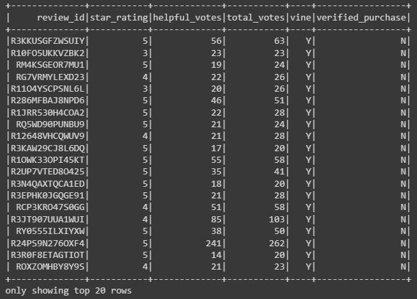
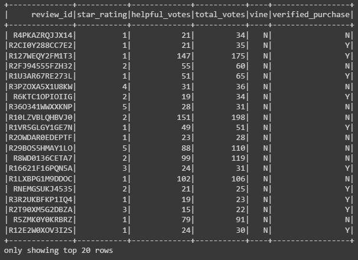

# Big Data with AWS and PySpark

## Overview:
Analyzing Amazon reviews written by customers who are part of the paid Amazon Vine program, which allows manufacturers and publishers to receive reviews for their products. Sellers can pay a small fee to Amazon and provide products to Amazon Vine members, who are then required to publish a review of that product.

In this analysis, we looked at customer reviews of video games purchased from Amazon (Data stored in Amazon Web Services S3 bucket [here](https://s3.amazonaws.com/amazon-reviews-pds/tsv/amazon_reviews_us_Video_Games_v1_00.tsv.gz)). Using Google Colaboratory as our remote workspace, we extracted the Amazon review data into a PySpark DataFrame. PySpark also allowed us to 'transform' our dataframe to match the structure of our relational database (AWS RDS). Finally, we loaded our dataframes into our database using Java Database Connectivity (JDBC).

## Results:
```
Total number of reviews:  40565
Total 5 star reviews:  15711
Total number of Vine reviews (paid reviews):  94
Total number of non-Vine reviews (unpaid reviews):  40471
Number of 5-star reviews from Vine reviewers:  48
Number of 5-star reviews from non-Vine reviewers:  15663
Percentage of Paid Reviewers awarding 5-star reviews:  51.06 %
Percentage of Unpaid Reviewers awarding 5-star reviews:  38.7 %
```
**Note**: The analysis above only considers reviews which were voted as 'helpful' at least 50% of the time, and received at least 20 votes in total.





### Summary:
Based on the analysis, it appears that the Amazon Vine program introduces some bias to the product reviews. We see that Vine reviewers give 5-star ratings to products far more often than unpaid reviewers (51% vs 38.7% respectively). 

Another analysis we could perform to test this theory, is to look at the average star rating provided by Vine reviewers vs non-Vine reviewers (as opposed to simply looking at the count of 5-star reviews). 